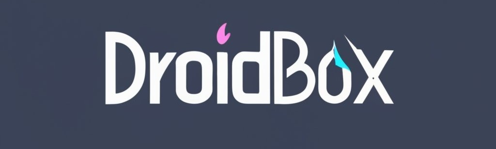

English 
&nbsp;&nbsp;| &nbsp;&nbsp;
<a href="https://github.com/eirkkk/Droidbox/blob/main/README.md">عربي</a>

## Installation

Download and install
[Termux](https://f-droid.org/repo/com.termux_118.apk),
[Termux-X11](https://raw.githubusercontent.com/eirkkk/Droidbox/main/app-arm64-v8a-debug.apk)

1. Start the Termux application and enter the following command, then press "Enter":
   ```bash
   curl -o setup.sh https://raw.githubusercontent.com/eirkkk/Droidbox/main/setup.sh && chmod +x setup.sh && ./setup.sh && rm setup.sh
   ```

2. After completing the Debian installation, run the following command to start Droidbox:
   ```bash
   droidbox --start
   ```

3. To install box64, box86, and their dependencies without taking up too much space on your device, use the following command:
   ```bash
   apt update && apt install wget -y && wget https://raw.githubusercontent.com/eirkkk/Droidbox/main/box.sh && bash box.sh && rm box.sh
   ```


4. After installing the app on your phone, return to the Termux application and enter the following command:
   ```bash
   droidbox --start
   ```
   Then, after opening the interface, enter this command:
   ```bash
   box
   ```
   After entering the "box" command, you'll see three options. Choose option number 2 to complete the emulator setup.

5. If you want to create your own custom drivers, use this command:
   ```bash
   cd /root
   apt update
   apt install wget
   wget https://raw.githubusercontent.com/eirkkk/Droidbox/main/build_deb_mesa.sh
   bash build_deb_mesa.sh
   ```

6. After the installation is complete, you will have two packages in the Desktop folder. Enter the Desktop folder to install the drivers:
   ```bash
   cd /root/Desktop
   dpkg -i mesa-vulkan-kgsl*armhf.deb
   dpkg -i mesa-vulkan-kgsl*arm64.deb
   ```

These are the ordered steps to install Mesa drivers and the graphics display application on your Android phone using Termux. Please note that this involves using the Wine emulator and technologies like Box86 and Box64 to run Windows applications on Android. It requires some command-line expertise and familiarity with the Android system to successfully follow these steps. Be aware that running Windows applications on this emulator may come with challenges and limitations.

## Third party applications

[Box64](https://github.com/ptitSeb/box64) MIT license

[Box86](https://github.com/ptitSeb/box86) MIT license

[Proot](https://github.com/termux/proot) GPL-2.0 license

[DXVK](https://github.com/doitsujin/dxvk) Zlib license

[DXVK-ASYNC](https://github.com/Sporif/dxvk-async)

[DXVK-GPLASYNC](https://gitlab.com/Ph42oN/dxvk-gplasync)

[VKD3D](https://github.com/lutris/vkd3d) LGPL-2.1 license

[D8VK](https://github.com/AlpyneDreams/d8vk) Zlib license

[Termux-app](https://github.com/termux/termux-app) GPLv3 license

[Termux-x11](https://github.com/termux/termux-x11) GPL-3.0 license

[Wine](https://wiki.winehq.org/Licensing)

[Mesa](https://docs.mesa3d.org/license.html) MIT license
