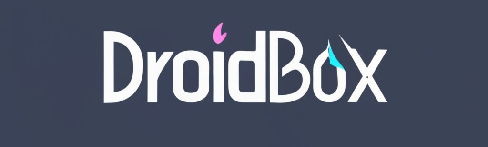

عربي
&nbsp;&nbsp;| &nbsp;&nbsp;
<a href="https://github.com/eirkkk/Droidbox/blob/main/README-EN.md">English</a>

1. قم بتشغيل تطبيق Termux وادخل الأمر واضغط على "Enter" :
```bash
curl -o install https://raw.githubusercontent.com/eirkkk/Droidbox/main/setup.sh && chmod +x setup.sh && ./setup.sh
```

2.. بعد الانتهاء من تثبيت Debian قم بتشغيل الأمر التالي لبدء droidbox:
```bash
droidbox --start
```
3.بعد تشغل Droidbox ضع الرابط لتثبيت box64 box86 مع التعريفات بدون اخذ الكثير من مساحة الجهاز
```bash
apt update && apt install wget && wget https://raw.githubusercontent.com/eirkkk/Droidbox/main/box.sh && bash box.sh && rm box.sh
```
4.. هاذي الخطوة لتثبيت برنامج عرض الرسوميات على هاتفك الاندرويد:
```bash
https://raw.githubusercontent.com/eirkkk/Droidbox/main/app-arm64-v8a-debug.apk
```

5.بعد الانتهاء من تثبيت البرنامج على الهاتف عد الى تطبيق Termux ادخل الامر  :
```bash
droidbox --start
```
.ثم بعد فتح الواجه ادخل هاذا الامر :

```bash
box 
````
بعد ادخال الامر box ستظهر لك ثلاث خيارات أختر الاختيار رقم :2 يكتمل تثبت التعاريف :
```bash
1) Run Wine. امر التشغيل مع اختيار مقاس الشاشه
2) Fix Wine.  امر ضبط المصنع للمحاكي 
3) Change Wine Version.  امر تغير اصدار المحاكي
0) Exit.  امر الخروج
   ````


6.. اذا كنت ترغب بصناعه تعريفات خاصه بك ادخل هاذا الامر :
```bash
cd /root
apt update
apt install wget
wget https://raw.githubusercontent.com/eirkkk/Droidbox/main/build_deb_mesa.sh
bash build_deb_mesa.sh
```
 7. بعد الأ نتهاء من التثبيت ستكون هناك حزمتين في مجلد Desktop قم بدخول الى مجلد Desktop لتثبيت التعريفات:
```bash 
cd /root/Desktop
dpkg -i mesa-vulkan-kgsl*armhf.deb
dpkg -i mesa-vulkan-kgsl*arm64.deb
```

هذه هي الخطوات المرتبة لتثبيت تعريفات Mesa وتثبيت برنامج عرض الروسميات على هاتفك الذكي باستخدام Termux. يجب عليك اتباعها بالترتيب المذكور للحصول على النتائج المطلوبة.

إذا كان لديك أي أسئلة أخرى، فلا تتردد في طرحها.

بعد ذلك، يجب أن يتم تشغيل سطح المكتب لمحاكي ويندوز Box86 و Box64 على جهازك الذي يعمل بنظام Termux. يُرجى ملاحظة أن هذه الإجراءات قد تتطلب وقتًا واستخدامًا مكثفًا للموارد، وقد يكون هناك متطلبات إضافية لتشغيل تطبيقات ويندوز على هذا المحاكي.
